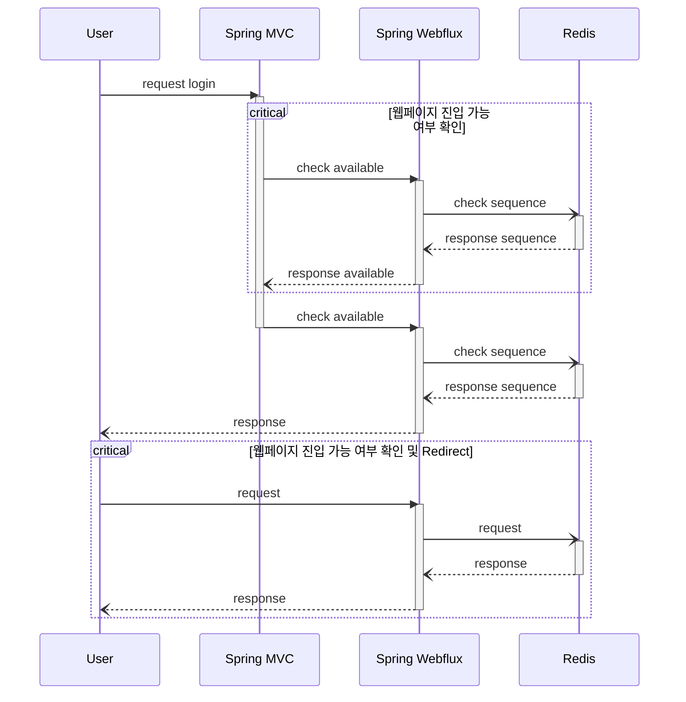

# funnel_service

funner service with Redis, Spring Webflux

## OpenAPI swagger-ui 

- [funner server](http://127.0.0.1:8080/webjars/swagger-ui/index.html)
- [main server](http://127.0.0.1:8000/swagger-ui/index.html)

## Architecture

- Redis: 접속 대기열 관리
- Embedded Redis: 테스트 전용 내장 레디스

## Memo

- cookie는 포트까지는 확인하지 않고 도메인 기반으로 작동하기 때문에, 서로 다른 서버에서 생성된 cookie를 활용할 수 있음